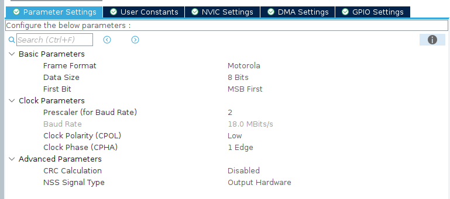

# USAGE
This README explains how to use the LCD library. This is intended for use on the DRD.

## Useful Links
* [DRD Altium Link](https://ubc-solar.365.altium.com/designs/A1D09E3F-0EB6-42A4-A897-C945D50A3C55?variant=[No+Variations]&activeDocumentId=E_PAS_DRD.SchDoc(1)&activeView=SCH&location=[1,95.68,26.62,35.19]#design)
* [LCD Basic Arduino Functionality GitHub Link](https://github.com/NewhavenDisplay/NHD-C12864A1Z_Example/blob/main/NHD-C12864A1Z/NHD-C12864A1Z.ino#L197)
* [LCD Printing Library GitHub Link](https://github.com/edeca/Electronics)
* [LCD Screen](https://newhavendisplay.com/content/specs/NHD-C12864A1Z-FSW-FBW-HTT.pdf)
* [LCD ST7565P Controller Datasheet](https://support.newhavendisplay.com/hc/en-us/article_attachments/4414878945687)

## What this Library Comes With
* Adds the weight of extra logic to program the LCD screen
* Adds a **1024 byte buffer** to hold LCD pixels. 
* Adds 4 files `lcd.h`, `lcd.c`, `font_verdana.h`, and `font_verdana.c` to your project.

## Initialization
Call the `LCD_init()` function once with a **pointer** to your SPI handle. This will likely occur in your `main.c` code. To initialize the SPI peripheral correctly set these fields as follows:

Possible differences
* Since the DRD does not have a 32kHz crystal oscillator you will likely have a different baudrate. The default baudrate **should** work, however, when debugging consider this problem.

## How to Set Values
There are 4 piece of data we display on the LCD screen
1. Speed (mph or kph)
2. Drive State (Drive 'D', Reverse 'R', Park 'P')
3. SoC (State of Charge in %) 
4. Pack Power as a horizontal bar

### Displaying the Speed
Call the `LCD_display_speed(speed, units)` function with the following parameters
* `speed`: The speed you want to display. This is a `uint32_t` type.
    * Speed will display normally **only** if `0 <= speed < 100`. Basically, 2 digits is the max displayed.
* `units`: The units you want to display. either `MPH` or `KPH`. These are defined in `lcd.h`.

### Displaying the Drive State
Call the `LCD_display_drive_state(drive_state)` function with the following parameter
* `drive_state`: The drive state you want to display. This is one of the following defines:
    * `FORWARD_STATE` displays a `D`, `REVERSE_STATE` displays a `R`, or `PARK_STATE` displays a `P`. These are defined in `lcd.h`.

### Displaying the SoC
Call the `LCD_display_soc(soc)` function with the following parameter
* `soc`: The SoC you want to display. This is a `uint32_t` type.
    * SoC will display normally **only** if `0 <= soc < 100`. Basically, 2 digits is the max displayed.
    * `100%` will display normally although the `%` will be cut off.

### Displaying the Pack Power
Call the `LCD_display_pack_power(pack_current, pack_voltage)` function with the following parameters
* `pack_current`: The current you want to display. This is a `float` type
* `pack_voltage`: The voltage you want to display. This is a `float` type

The intention is to take these values directly from the CAN message and input them into this function.
* Note: We use **`-3000W`** as the minimum power and **`+5400W`** as the maximum power. This is to ensure the bar is always displayed correctly. The calculated power will be normalized to this range.

## Library Functionality
There are extra functions we can add to the library, however, they are removed to make the file simple to read. Please see this [link](https://github.com/edeca/Electronics) for the original library code which also has more fonts!
