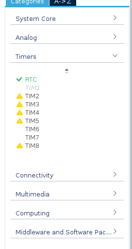
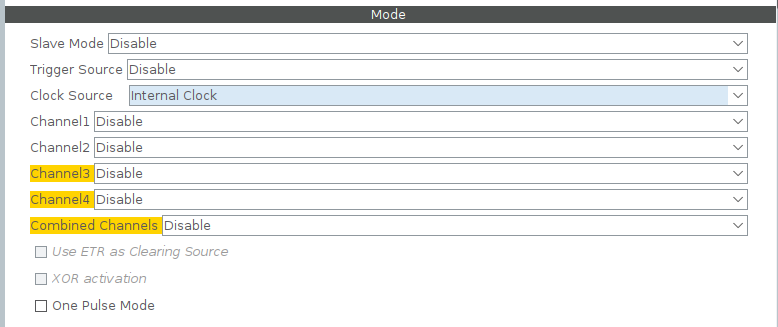
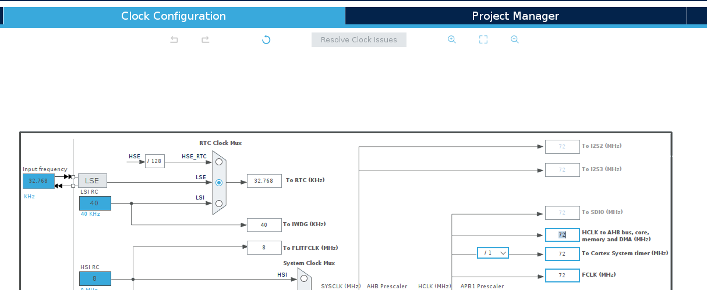
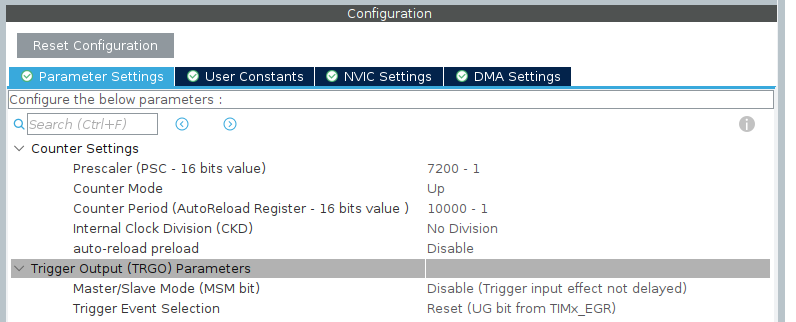
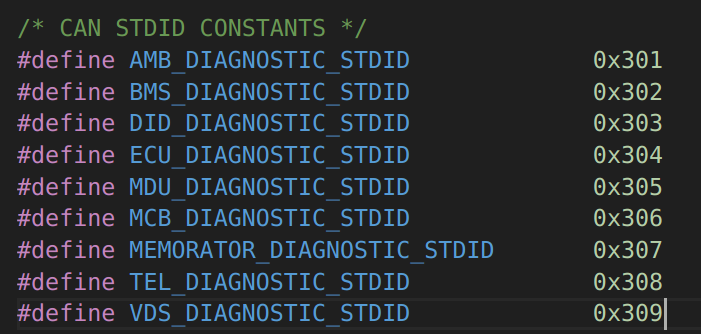
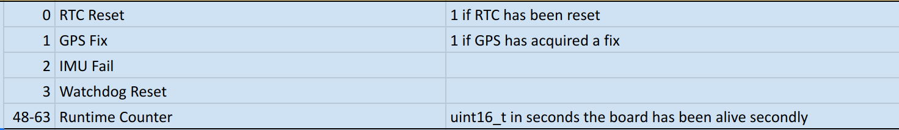

# Diagnostic Message Set-Up
To set up the diagnostic message for your board there are two primary steps.
1. Create and set-up a hardware timer at the specified rate.
2. Construct the data field of a diagnostic message and update the DBC's signals for it.
2. Add the `DIAGNOSTIC_handler` function to the interrupt handler for the timer.
    - **Parameter 1**: CAN standard ID for your board's diagnostic message as a paramter to the `DIAGNOSTIC_handler` funciton.
    - **Parameter 2**: 6 byte data field of your diagnostic message. Internally an 8 byte message however the last 2 bytes are reserved in the `DIAGNOSTIC_handler` function for the `uint16_t` runtime counter.
    - **Parameter 3**: The CAN handle for your board.
    - **Parameter 4**: The mailbox for your board's CAN handle.

## Setting up a Hardware Timer
1. Navigate to your boards `*.ioc` file.
2. Open it and open the **Timers** tab.
    - 
3. Out of the avaliable timers select one. **For this example I will use TIM2**
4. In the menu of your selected timer change **Clock Source** to **Internal Clock**:
    - 
5. Now, we want the diagnostic message to run at 1 second intervals. To do this, we need to set up the prescaler and the counter period so that the clock counts up to the counter period in 1 second of time.
    - First, we need to check the HCLK rate on your board. This will tell use the refernce clock for the timer we are setting up.
    - Navigate to the Clock Configuration section in the `*.ioc` and check the constant in the box beside HCLK (mine is highlighted 72 in the picture). This is the clock frequency in **MHz**:
        -  
    - Now to determine the prescaler and counter period we have some constraints
        - Firstly, these values are limited to 16 bits max. Thus we can only choose values 0 - 65535 inclusive.
        - In my case, if I wanted to use the HCLK frequency and have a counter period to last 1 second, I would need 72 million ticks before 1 second passes. Unfortunetly, 72,000,000 > 65535 so we need to choose something else. This is where the prescaler comes in.
            - The prescaler divides the HCLK frequency down which means the ticks occur at a lower frequency and thus less ticks are needed for 1 second to pass. 
        - In my case, **I will use prescaler = 7200 - 1** and **counter period = 10000 - 1**. The reason you need the `-1` is because the formula relating prescaler, counter period, and clock frequency is as follows: `counter_period + 1 = HCLK / (prescaler + 1)`. This is because the ticks are zero-indexed.
        - 
6. Now we need to make this timer's callback be interrupt based whenever the counter period (1 second) is up. To do this select the **NVIC Settings** tab and enable the global interrupt for your timer:
    - 
7. Make sure to click `Ctrl + S` to save your changes and let STM32CubeMX/IDE generate the code for you.

## Constructing the Diagnostic Data Field
This section explains how to set up the 6 bytes in your data field. 
1. Open the CAN ID table and find the message ID for the diagnostic message for your board
    - 
2. From here add rows to specify what other signals you want to see with your diagnostic message. Your signals can only be 48 bits total because the upper 16 bits of the diagnostic message are reserved for the runtime counter. For example, the TEL board's diagnostic message has the following signals:
    - 
3. Now that we have specified the signals we want we need to package the signals into the 6 byte data field (remember this is without the runtime counter so in the TEL board's case we only need to pack `RTC_reset`, `GPS_Fix`, `IMU_Fail`, and `Watchdog Reset`).
    - Here is an example of how TEL has set up its diagnostic message:

    **Undefined symbolic constants are defined in `diagnostic.h`**:

    **In TEL for example**:
    ```c
    #include "diagnostic.h"

    #define RTC_RESET_BIT         0
    #define GPS_FIX_BIT           1
    #define IMU_FAIL_BIT          2
    #define WATCHDOG_RESET_BIT    3
    #define FLAG_HIGH             1
    #define FIRST_BYTE_INDEX      0
    #define UNINITIALIZED         0

    // Start logic to set user_diagnostic_data
    uint8_t user_diagnostic_data[USER_DIAGNOSTIC_MSG_LENGTH] = {UNINITIALIZED};      
    uint8_t user_diagnostic_data_byte = UNINITIALIZED;

    // SET_BIT is defined in stm32fxx.h
    // #define SET_BIT(REG, BIT)     ((REG) |= (BIT))
    if (g_tel_diagnostics.rtc_reset) 
      SET_BIT(user_diagnostic_data_byte, FLAG_HIGH << RTC_RESET_BIT);
    if (g_tel_diagnostics.gps_fix)
      SET_BIT(user_diagnostic_data_byte, FLAG_HIGH << GPS_FIX_BIT);
    if (g_tel_diagnostics.imu_fail)
      SET_BIT(user_diagnostic_data_byte, FLAG_HIGH << IMU_FAIL_BIT);
    if (g_tel_diagnostics.watchdog_reset)
      SET_BIT(user_diagnostic_data_byte, FLAG_HIGH << WATCHDOG_RESET_BIT);

    user_diagnostic_data[FIRST_BYTE_INDEX] = user_diagnostic_data_byte;
    // End logic to set user_diagnostic_data

    // It is recommended to set this array inside the timer callback if statement for your timer. See next section for more details.

    ```

    - Your goal is to fill the 6 byte data field to the spec of the CAN ID table (and change the DBC accordingly if you add custom diagnostic signals later). The DBC is already updated for the 16 bit runtime counter.

## Adding the `DIAGNOSTIC_handler` Function to the Timer Callback
1. In `main.h` include the `diagnotic.h` file:
    ```c
    #include "diagnostic.h"
    ```
2. Navigate to the `main.c` file in your project.
3. Either extern or define `CAN_HandleTypeDef hcan` and `uint32_t can_mailbox`
    - This is so that the diagnostic message is sent on the correctly on the CAN bus.
4. Search for the `HAL_TIM_PeriodElapsedCallback` function
5. Inside this function where it says `USER CODE BEGIN Callback` add the following (may need to adjust paramters depending on your code):
    ```c
    if (htim->Instance == <YOUR TIMER>)
    {
        // ...
        // logic to set user_diagnostic_data
        //..

        DIAGNOSTIC_handler(<YOUR BOARD>_HEARTBEAT_STDID, user_diagnostic_data, &hcan, can_mailbox);
    }
    ```

**Now you are done setting up the dignostic message for your board!**
