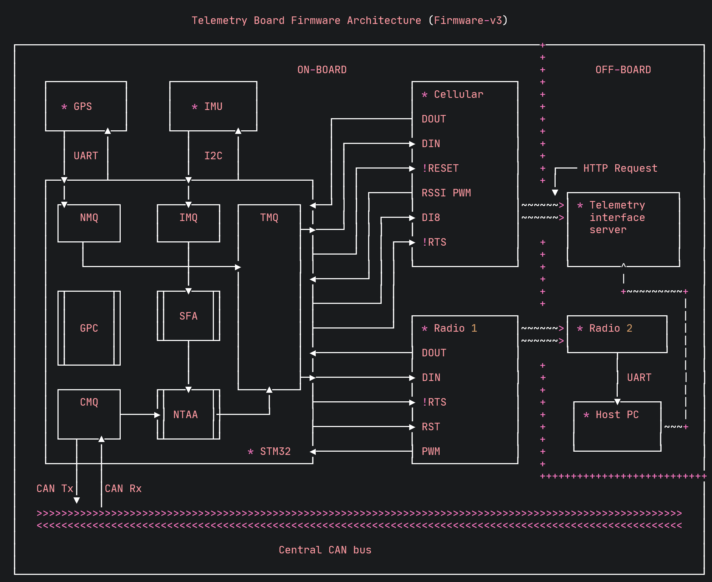

# Telemetry board (TEL) firmware architecture

## Overview

The minimum required functionality of the telemetry board is described below:

- Transmitting CAN message data over cellular/radio to Solar's telemetry interface
- Transmitting GPS information to Solar's telemetry interface
- Transmitting IMU (inertial measurement unit) data to the telemetry interface

Some optional/experimental features include:

- A sensor fusion algorithm to combine the IMU and GPS data to give us the absolute orientation of the car in 3D space.
- Receiving firmware updates via the radio module.

## Architecture diagram



## Architecture description 

### Peripherals

- **GPS**: this peripheral provides us with the location of the car at all time along with various other pieces of information.
- **IMU**: stands for inertial measurement unit. Provides instantaneous accelerations and angular momentum in 3 dimensions.
- **Radio**: uses RF magic to transit information to secondary radio receiever. This will be the main communication method used by the board.  
- **Cellular**: uses RF magic + cellular networks to transmit information directly to the telemetry interface server over the internet using HTTP. Will be used as more of a fail-safe communication method.

### Queues

This a list of the software queues that will be used for the telemetry board firmware. CMSIS-RTOS v2 provides API calls for creating these queues.

- **NMEA message queue (NMQ)**: this queue stores pointers to NMEA message structs. These NMEA messages are produced by the GPS and are transmitted to the microcontroller over UART.
- **IMU message queue (IMQ)**: this queue stores pointers to IMU message structs. These IMU messages need to be built up by reading from the IMU registers since the communication protocol is I2C.
- **CAN message queue (CMQ)**: this queue stores pointers to CAN message structs. These CAN message structs also need to be built up as CAN messages come in.
- **Transmission message queue (TMQ)**: this queue holds all of the processed messages (i.e., they are in a serial character stream) that have been queued up for transmission over radio/cellular.

### Algorithms/methods

**General peripheral control (GPS)**

The main function for this block is to keep track of the status of transmitting peripherals (i.e., radio and cellular) and data peripherals (i.e., GPS and IMU). This includes any initialization work when the board powers up, ensuring the cellular, radio, and GPS modules are receiving a signal, performing test transmissions, etc. 

**Sensor fusion algorithm (SFA)**

This algorithm is responsible for combining the data produced by the IMU and the GPS and calculating the absolute orientation of the car in 3D space. This is by no means essential functionality but I thought it would be a fun little project. Who knows if we can even transmit the orientation data fast enough for it to be useful. 

**Number-to-ASCII algorithm (NTAA)**

Since we have to communicate with the radio and the cellular module over UART, we can only send serial characters to them. We have three different kinds of messsages to send: NMEA messages, CAN messages, and IMU messages. NMEA messages already come in as a serial character stream so they make their way from the NMQ to the TMQ without any additional processing. CAN messages and IMU messages on the other hand need to be converted to a serial character stream and that is what this algorithm is in charge of.

## Message types

### NMEA messages

The general structure of an NMEA message is shown below:

```
$GPZDA,141644.00,22,03,2002,00,00*67<CR><LF>
```

Breaking that down, we have:

```
       talker ID                                 checksum

           │                                         │
           │                                         │
           ▼                                         ▼
        $ GP  ZDA,    141644.00,22,03,2002,00,00    *67  <CR><LF>
        ▲      ▲                  ▲                          ▲
        │      │                  │                          │
        │      │                  │                          │
NMEA ───┘      │                  │                          │
msg            │                  │                          │
identifier     │
               │               data field              carriage return
               │        (delimited with commas)         + line feed

            defines
          msg contents
```

These messages arrive from the GPS module and are already in a serial character stream. This means no additional processing is required before it is queued up for transmission over radio/cellular.

### CAN messages

The structure of a full CAN message is shown below:

```
                   ◄─────────────────────────────────── CAN Data Frame ──────────────────────────────────────►

                   ┌───────┬────────────┬───────┬──────────┬──────────────────────────────────┬───────┬───────┐
                   │  SOF  │ Message    │  RTR  │  Control │             Data field           │  CRC  │  ACK  │
                   │       │ identifier │       │  field   │                                  │       │       │
                   └───────┴────────────┴───────┴──────────┴──────────────────────────────────┴───────┴───────┘
No. of bits ──────►    1         11         1         6                    0..64                  15      1

                                  ▲
         Between    ──────────────┘
      0x400 - 0x7FF
      for Brightside        ◄─── Arbitration ───►
                                    field
```

When we receive a CAN message on the telemetry board, the only values we actually care about are the ID, the data payload, and the timestamp generated by the MCU. These will be stored in a struct that looks like the following:

```c
struct CAN_msg {
    uint16_t msg_id,
    uint8_t data[8],
    uint16_t timestamp
}
```

Since we're communicating with the cellular and radio modules over UART, this CAN message struct must be converted into a bit stream. For simplicity's sake, we will borrow the character stream format used by NMEA messages. That is, we will start with an identifier character ("#" for CAN messages) and delimit our fields with commas. An example of what a CAN message struct might look like is shown below:

```c
struct CAN_msg example_msg = {
    .msg_id = 0x402,
    .data = {0x11, 0x22, 0xAA, 0xBB, 0xCC, 0xDD, 0xEE, 0xFF},
    .timestamp = 0xE26A
}
```

This CAN message struct would be transformed into the following character stream:

 ```
#402,1122AABBCCDDEEFF,E26A<CR><LF>
 ```

Once transformation is complete, the message would be able to be transmitted to the cellular and radio module. 

### IMU messages

TODO: finish section
