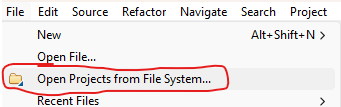
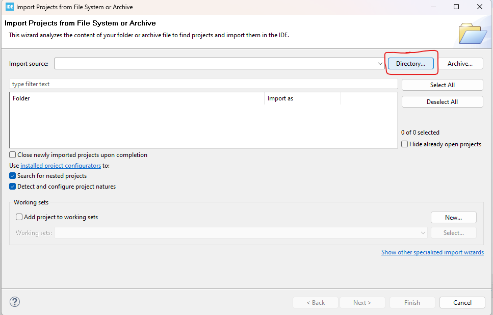
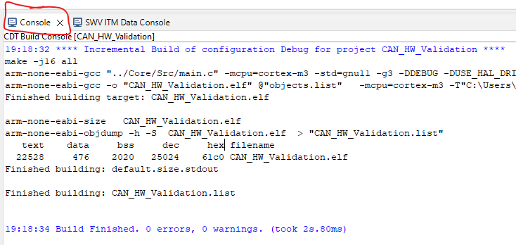
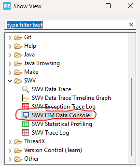

# CAN Hardware Validation Testing

> [!NOTE] 
> This STM32 project is intended to be used as a tool to validate the CAN hardware of new boards. It enables us to validate whether the CAN hardware works or not before performing any further testing. 
> 
> This README doc highlights how to use this STM32 Project for this purpose.

## Table of Contents
- [CAN Hardware Validation Testing](#can-hardware-validation-testing)
  - [Table of Contents](#table-of-contents)
  - [Setup](#setup)
  - [Project Details](#project-details)
  - [Using the Serial Monitor to view `printf` output](#using-the-serial-monitor-to-view-printf-output)
    - [If using UART:](#if-using-uart)
    - [If Using SWO:](#if-using-swo)

## Setup

Open the CAN_HW_Validation project in STM32CubeIDE as follows:
   

## Project Details

This project performs CAN Hardware Validation Testing in a very simple manner:

* The infinite while loop contains code to receive and transmit a CAN message.
* Upon receiving a CAN message, it will use `printf` to print "Received CAN message!" to the console. 
* Following this, it will create and transmit a CAN message and again use `printf` to print "Sent reply CAN message" to the console.
* Then, it waits for 3 seconds before repeating the process.
  * The parameter `DELAY_TIME` can be modified if required.

> [!NOTE]
> There are two ways to make `printf` output to a PC COM port: with UART or with SWO. Please see `./Src/debug_io.c` for the following details:
> 
> * This project is configured to use either one of these methods depending on which of the `USE_UART` or `USE_SWO` macros are in use. 
> * One should be commented out. By default, the `USE_UART` is selected, which means that the project is configured to use UART. 
> * If you wish to use SWO instead, comment out this macro and uncomment the `USE_SWO` macro.

## Using the Serial Monitor to view `printf` output

### If using UART:

The `printf` output will print to the Serial Console in the STM32CubeIDE.

> This is a great resource to learn about the process of using `printf` to output over UART: 
> 
> [DigiKey: Easily use printf on STM32](https://forum.digikey.com/t/easily-use-printf-on-stm32/20157)

### If Using SWO:
The `printf` output will print to the SWV ITM Data Console in the STM32CubeIDE.

To open this console, go to `Window -> Show View -> SWV -> SWV ITM Data Console`.

> [!NOTE]
> You may be required to press "Other" under `Window -> Show View` to find the SWV option.

> This is a great resource to learn about the process of using `printf` to output over SWO: 
> 
> [PCB Artists: Debug printf on STM32 using SWO serial wire](https://pcbartists.com/firmware/stm32-firmware/debug-printf-stm32-using-swo-serial-wire/#:~:text=Enable%20SWO%20Debug%20Output%20in%20STM32%20CubeMX&text=In%20the%20active%20debug%20configuration,Serial%20Wire%20Viewer%20(SWV).&text=Find%20SWV%20settings%20and%20enable,terminal%20to%20show%20you%20logs.)
