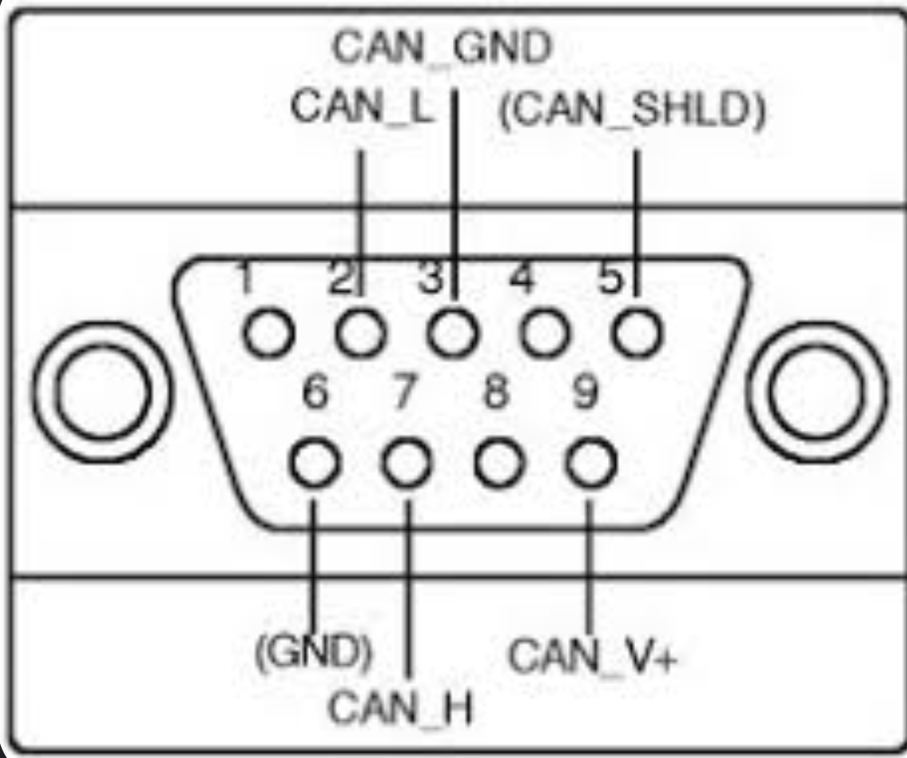
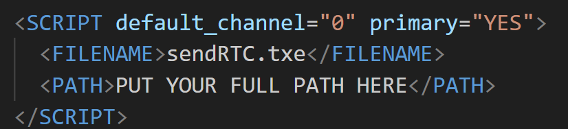

# T Programming with the Memorator
This document describes how to use the Memorator to send and receive messages on the CAN bus. The Memorator is a device that can be used to monitor and record CAN bus traffic. It can also be used to send messages on the CAN bus. This guide outlines the following:
* How to set up CANlib on Linux and Windows
* How to set up a t programming environment. [Documentation for language](https://resources.kvaser.com/PreProductionAssets/Product_Resources/kvaser_t_programming_language_4_19_240522.pdf)
* How to set up the **Kvaser Memorator Pro 2xHS v2**
* How to download a configuration file and the t program to the Memorator

## Setting up CANlib on Linux and Windows
The primary guide you will use is this [**KVASER CANlib and Python Part 1: Initial setup**](https://kvaser.com/developer-blog/kvaser-canlib-and-python-part-1-initial-setup/). In this guide, the windows installation is straightforward to download because you only need to run the executable. The Linux installation, however, has quite a few nuances so those will be covered below.

First, you will need to install the following software:
* [Kvaser Linux SDK Library](https://kvaser.com/single-download/?download_id=47184) (kvlibsdk)
* [Kvaser Linux Drivers and SDK](https://kvaser.com/single-download/?download_id=47147) (linuxcan)

Once you have these downloaded follow this [**video**](https://www.youtube.com/watch?v=Gz-lIVIU7ys&ab_channel=Kvaser)
* A problem you may encounter is that the linux kernel headers are not installed. If this is the case run: `sudo apt-get install linux-headers-generic`
* You may see an error saying that `'pkg-config'` is not installed. To install it do `sudo apt-get pkg-config`. 
* Another issue can be that the compiler required for building linuxcan is `gcc-12`, however, by default Ubuntu may come with `gcc-11`. In this case, run: `sudo apt install --reinstall gcc-12`
* As for building kvlibsdk, you may need to install these packages: `sudo apt-get install zlib1g`, `sudo apt-get install zlib1g-dev`, `sudo apt-get install libxml2`, and `sudo apt-get install libxml2-dev`.

Once you have installed all the modules correctly and successfully, you can run `pip install canlib`.

**Now you are ready to use the Memorator!**

## Setting up a t programming environment
To set up a t programming environment, you will need to install the following software:
* TRX IDE (Should already have came with the modules you installed)

In this IDE we will be creating our t script project and script files. Follow this [**video guide/course**](https://kvaser.com/course/intro-t-programming/) for a good understanding of the workflow and features of the TRX IDE (~30 mins). 

Once you have an understanding of the IDE, you can open a new project and put the `sendRTC.t` script in it. Now, you will need to set up the memorator:

## Setting up the Kvaser Memorator Pro 2xHS v2
Here is how to set up configuration and wiring for the memorator:

### Configuration Set Up
1. First, plug the memorator USB into your device and into the memorator
2. Open the **Kvaser Memorator Config Tool** application
3. Then click on the **Connect** button on the top row of options
4. Locate and select the Kvaser Memorator Pro 2xHS v2
5. For the first time using the memorator, it is recommended to initiliaze the disk in the **disk management** section
6. Now we need to enter in the following bus configurations: **500kbit/s, 88% sampling rate, SJW = 1 BTR0 = 0x00, BTR1 = 0x1C, silent mode = off**. Also in databases you add the `brightside.dbc` file. However, if you need to change the bit timing to your needs then you can do so.
7. Apply all these configurations and click **Download** to put these configurations on the memorator.

### Wiring Set Up

1. Connect memorator to 12V power supply and its CAN H and CAN L to the TEL board's db9 pin. **YOU MUST USE CAN 1 CHANNEL** if you will use the `sendRTC.t` script. This is because the t program is hardcoded to send on that channel.
2. Find a board to connect to (we will use TEL) and connect a 5V ST link to the board so it can receive CAN messages. I also connected a 3.3V ST Link so I can flash the firmware and do debugging although this is not necessary. 
3. Connect memorator USB cable to your device. Make sure to have the python `DownloadXML.py ` script and the compiled `sendRTC.txe` ready.

### Downloading the Configuration File and T Program
1. Go into the `sendRTC.xml` and make sure it matches your needs. One thing you will need to change is the `PATH`. For example, I put `C:\Users\Aarja\Documents\UBC\UBC_Solar\firmware_v3\tools\t_programs\sendRTC` for my device.

2. If you need to change the bit timing here is [a guide that explains how](https://www.youtube.com/watch?v=2nzkaYQK0YM&ab_channel=Kvaser)
3. With the memorator plugged in with the USB we can now begin running the `DownloadXML.py` script. **Before running the script, edit the `XML_CONFIG_FULL_PATH` constant to your full absolute path to the xml file. If it does not work unplug and plug the memorator's USB back in and make sure that no other applications are using the memorator.
)
4. If you see the following then the download was successful. You can ignore the deprecation warnigns
5. Now, unplug the memorator USB cable to enter logging mode (and make sure it is being powered with the CAN bus on Channel 1). 
6. You should see the CAN 1 channel LED blinking at the rate of messages being sent by the memorator
7. If you have radio connected and sunlink running on the serial port you should see the 0x300 messages come through. The command to show only RTC timestamp messages in the terminal is: `./link_telemetry -p /dev/ttyUSB0 -b 230400 --table-on 0x300 --no-write`

## Using the Memorator 
There are two ways you will use the memorator:
1. For programming using the TRX IDE 
2. Configuring CAN bus and logging parameters.

### For programming using the TRX IDE
The TRX IDE is an IDE that is downloaded when you install the Kvaser [CANlib SDK](https://kvaser.com/developer/canlib-sdk/) from their website. To use it I recommend using this ~1h youtube course. There are multiple parts. Here is the [first video](https://www.youtube.com/watch?v=j3DidYWQ_TQ).

The purpose of using this IDE as opposed to VSCode is to make compiling the t program easier (although they mention a CLI way to compile. This did not work for me, however) and connecting to the Kvaser memorator for testing. 

The typical workflow goes as follows
1. Idea for adding a software feature on the Kvaser Memorator (lets say sending out a CAN message)
2. Read [documentation of t programming language](https://resources.kvaser.com/PreProductionAssets/Product_Resources/kvaser_t_programming_language_4_19_240522.pdf) to see if adding your feature is possible.
3. If the feature is possible then open up the TRX IDE and create a new project.
4. Then create a `*.t` file and start programming your feature.
5. Once you are done programming it, compile it, plug in the Memorator and test the compiled  t program,
6. To perform the test in logging mode (the mode where 12V is provided via CAN bus V+ pin and no USB plugged in), you need to use the `DownloadXML.py` script to download the configuration file and compiled t program to the memorator.
7. Once the download is successful, unplug the memorator USB cable and plug in the 12V power supply to the CAN bus V+ pin.
8. Now see if your feature works!

### Configuring CAN bus and logging parameters
To do this you will use the memorator config tool. This is a separate download at [this link](https://kvaser.com/single-download/?download_id=47167). This is only available for Windows.

Once you have this software downloaded, connect your memorator via its USB to your computer. Then inside the memorator config tool click connect and select the memorator. 

With the memorator connect you can do many things. For example, if you cannot use the `DownloadXML.py` script to download the configuration file you can manually set CAN bitrate and other parameters in the GUI of the memorator config tool. 

Additionally, you can go to the logging section and clear the disk, perform a check, format the disk, and read log files. 

[**Here is Monday Update of all the work/debugging in the memorator for more detail**](https://ubcsolar.monday.com/boards/3313681052/pulses/6563392826?term=memor&termColumns=XQAAAAJvAAAAAAAAAABBKoJ4MRmOSvlPTDV2Qow42wcHf67VzsBdKlCbBGsDUWUe9ZBNkdE8anb-D9z8-b1wBiZRkBInPvJQFM9-LnxSVAbsA45GP2YL3_0uWUA)

